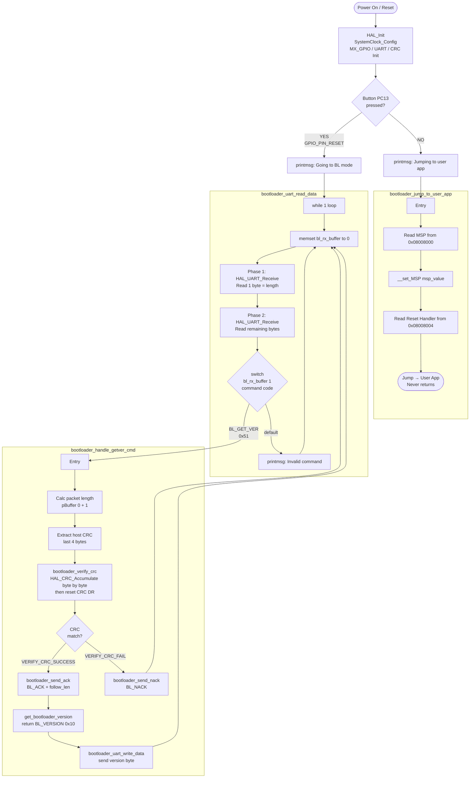

```mermaid
flowchart TD
    A([Power On / Reset]) --> B[HAL_Init\nSystemClock_Config\nMX_GPIO / UART / CRC Init]
    B --> C{Button PC13\npressed?}

    C -- "YES\nGPIO_PIN_RESET" --> D[printmsg: Going to BL mode]
    C -- NO --> E[printmsg: Jumping to user app]

    E --> F

    subgraph jump["bootloader_jump_to_user_app"]
        F[Entry] --> F1[Read MSP from 0x08008000]
        F1 --> F2[__set_MSP msp_value]
        F2 --> F3[Read Reset Handler from 0x08008004]
        F3 --> F4([Jump → User App\nNever returns])
    end

    D --> G

    subgraph uart_read["bootloader_uart_read_data"]
        G[while 1 loop] --> H[memset bl_rx_buffer to 0]
        H --> I[Phase 1: HAL_UART_Receive\nRead 1 byte = length]
        I --> J[Phase 2: HAL_UART_Receive\nRead remaining bytes]
        J --> K{switch\nbl_rx_buffer 1\ncommand code}
        K -- default --> M[printmsg: Invalid command]
        M --> H
    end

    K -- "BL_GET_VER\n0x51" --> L

    subgraph getver["bootloader_handle_getver_cmd"]
        L[Entry] --> L1[Calc packet length\npBuffer 0 + 1]
        L1 --> L2[Extract host CRC\nlast 4 bytes]
        L2 --> L3[bootloader_verify_crc\nHAL_CRC_Accumulate byte by byte\nthen reset CRC DR]
        L3 --> L4{CRC\nmatch?}
        L4 -- VERIFY_CRC_SUCCESS --> L5[bootloader_send_ack\nBL_ACK + follow_len]
        L4 -- VERIFY_CRC_FAIL --> L6[bootloader_send_nack\nBL_NACK]
        L5 --> L7[get_bootloader_version\nreturn BL_VERSION 0x10]
        L7 --> L8[bootloader_uart_write_data\nsend version byte]
    end

    L8 --> H
    L6 --> H
```